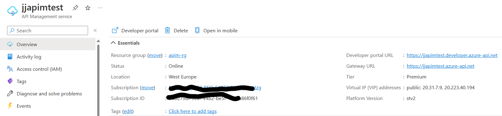
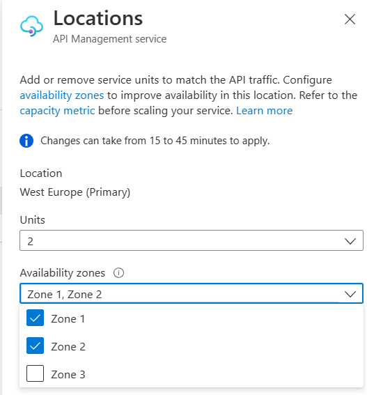
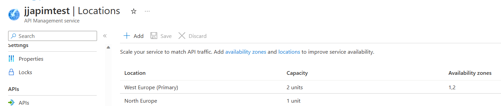
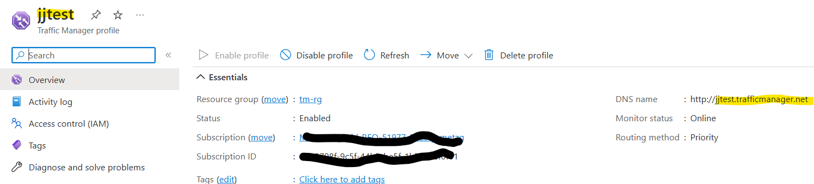
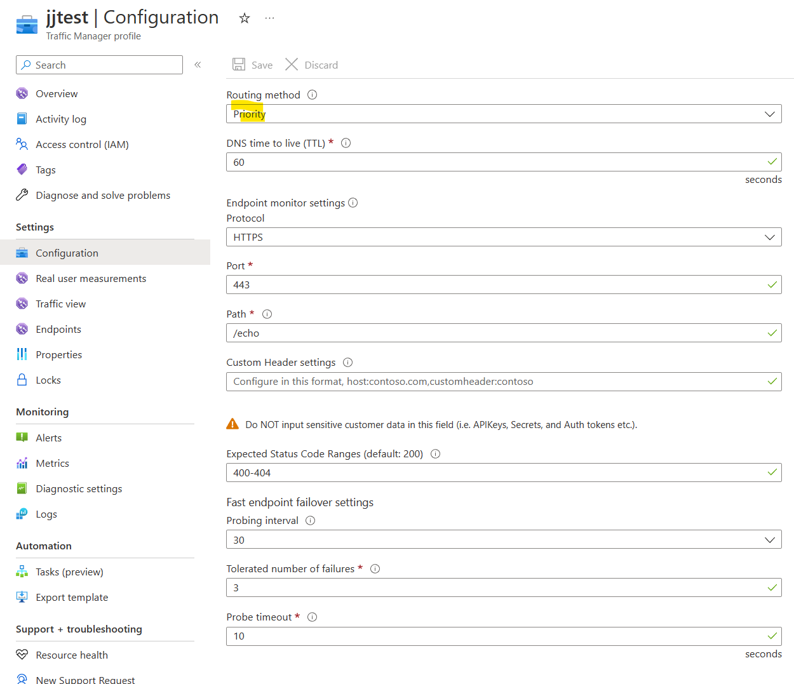
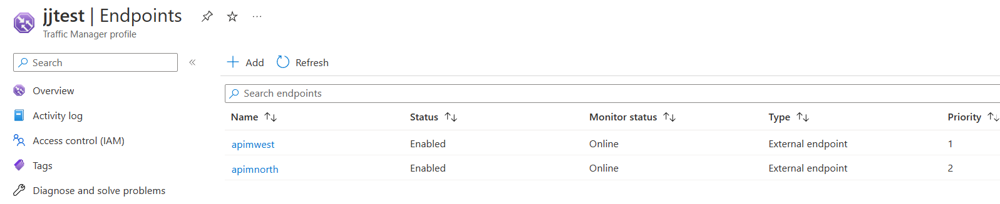
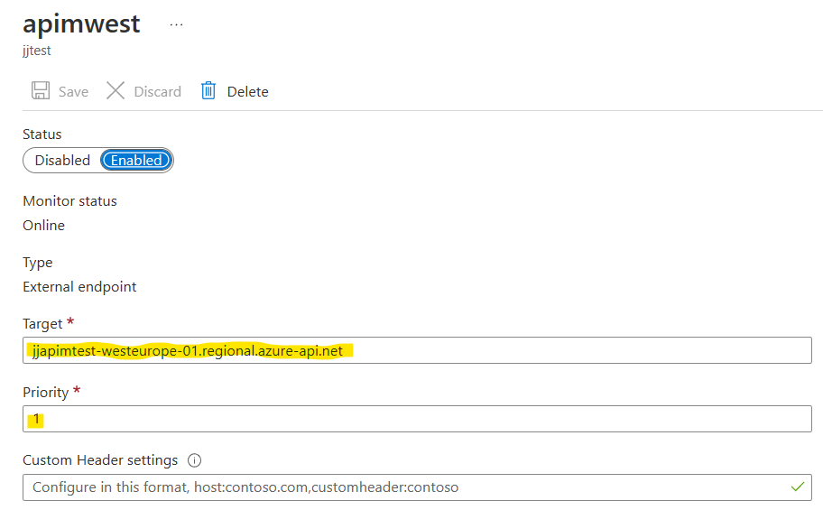
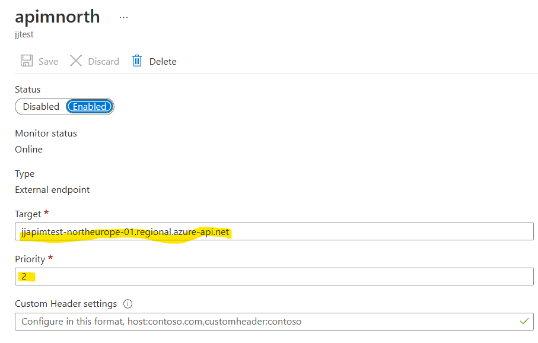
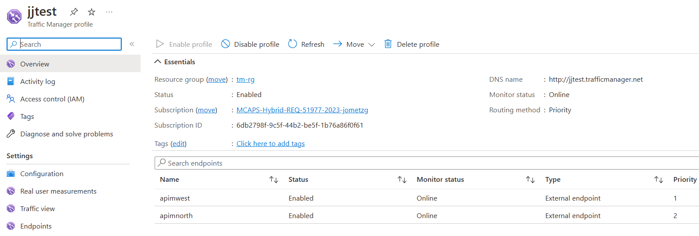

# Azure API Management with Azure Traffic Manager

[Azure API Management](https://learn.microsoft.com/en-us/azure/api-management/api-management-key-concepts) (APIM) is an API gateway that allows a team or company to control access to a series of APIs. It does not implement the APIs, but provides a means of discovering, curating, controlling access to APIs.

API Management in its Premium SKU is able to be scaled across availability zones in order to provide more scale and resilience from a single data centre failure. Please look [here](https://learn.microsoft.com/en-us/azure/reliability/availability-zones-overview) for more on what availability zones are.

## The need for a multi-region deployment of API Management
[Multi-region](https://learn.microsoft.com/en-us/azure/api-management/api-management-howto-deploy-multi-region) deployment of API Management is useful for exposing APIs to consumers of those APIs in different geographic regions with reduced latency. It also enables the APIs to still function in case of a region-wide outage.

It is important to note:

*With multi-region deployment, only the gateway component of your API Management instance is replicated to multiple regions. The instance's management plane and developer portal remain hosted only in the primary region, the region where you originally deployed the service.*

So, when multiple regions of an API management instance are created, only the *gateway* or proxy and its meta data is replicated. The portals remain in the primary region.

## Request Routing with multi-region API Management
By default, when setting up a multi-region implementation of API Management, an instance of [Traffic Manager](https://learn.microsoft.com/en-us/azure/traffic-manager/traffic-manager-overview) is embedded into API Management and so the main URL of traffic manager. This instance of traffic manager is set to *Performance Based* routing - which means that a client using APIM, will resolve a traffic manager instance, which will then send requests to the least APIM gateway in a region which has the lowest latency form the client. In many respects, this is ideal as traffic will land at the gateway in the region "nearest" to the client.

This, however is not ideal for all circumstances, so APIM has the ability to work alongside a [separate instance](https://learn.microsoft.com/en-us/azure/api-management/api-management-howto-deploy-multi-region#-use-custom-routing-to-api-management-regional-gateways) if Traffic Manager - where you can configure the policy and region targets of traffic manager to suit your requirements.

The rest of this article details an approach to this for one scenario.

## Scenario
In this scenario, there are a few requirements:
1. Multi-region, but control costs
2. Not rely on a single instance of the gateway in the primary region (preferably 2 instances in different availability zones
3. An instance in another region - primarily for DR
4. In normal circumstances direct all requests to the primary region - the one with more than one instance - for scale and resilience

In this scenario, there is no single point of failure in the primary region and this is the one with most scale, but there is also a smaller secondary region for times of a full region outage.

This will require a separate instance of traffic manager to be deployed and configured to work with API Management.

## API Management Configuration
Firstly, API Management needs to be configured as a premium SKU. Looking at the overview of APIM, it should look something like:

As can be seen above, this API Management instance has the name *jjapimtest* and so its URL is https://jjapimtest.azure-api.net - yours will be different.

To configure multi-region, look for the *Locations* section in the portal, this should initially have one location with one instance in the same region as your APIM instance was created. In my case this is *West Europe*

Now amend the primary location to have more than one instance. Ideally choose the instances to be in different availability zones:

Now add a new location. This can be anywhere. In my case I have chosen *North Europe* and a single instance.

In the above, I have a single instance in North Europe for this scenario. This could have 2 instances like the primary one - if we wanted to direct traffic to both. But for this use case, we want to keep this as a DR instance and keep costs under control by configuring it to have a single instance.

### So, what do we have now?
We have a multi-region APIM instance where the main URL https://jjapimtest.azure-api.net will direct traffic to either of the locations - North Europe or West Europe depending on where the client is. This is fine for most scenarios, but not for ours where we want in normal circumstances to direct traffic to West Europe - the one with 2 instances in different availability zones - so should be more reliable than a single instance in the other zone. But overall cheaper that 4 instances.

To do this we now need to add and configure traffic manager.

## Add a new Traffic Manager Profile
Traffic manager is a separate service that works at the DNS or network layer 4 level. It needs to be created and configured to point to each of the regions that API Management is now configued to be in.

Above is the basic overview of the traffic manager profile. The only important thing at this point is its name and therefore FQDN in my case http://jjtest.trafficmanager.net - this will be the endpoint that clients will later call.

Now we need to configure how traffic manager will [route requests](https://learn.microsoft.com/en-us/azure/traffic-manager/traffic-manager-routing-methods). We are here going to choose [Priority](https://learn.microsoft.com/en-us/azure/traffic-manager/traffic-manager-routing-methods#priority-traffic-routing-method)

In the above, we have configured a low 60 second DNS time to live (TTL). The most important steps are to configure how traffic manager knows the target endpoint is *alive*. This is done by sending an HTTP(S) request to a path and expecting a response. With a service that is not authenticated, an HTTP OK or 200 is the best choice, but for an API that may need to be authenticated, I have chosen getting some 400 series responses - it is best to work with the path and the configuration of API Management to make sure that traffic manager's probes are successful - otherwise it will chose another endpoint - in this case lower in the priority order.

